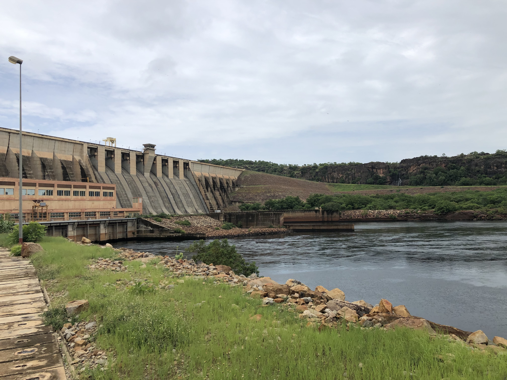
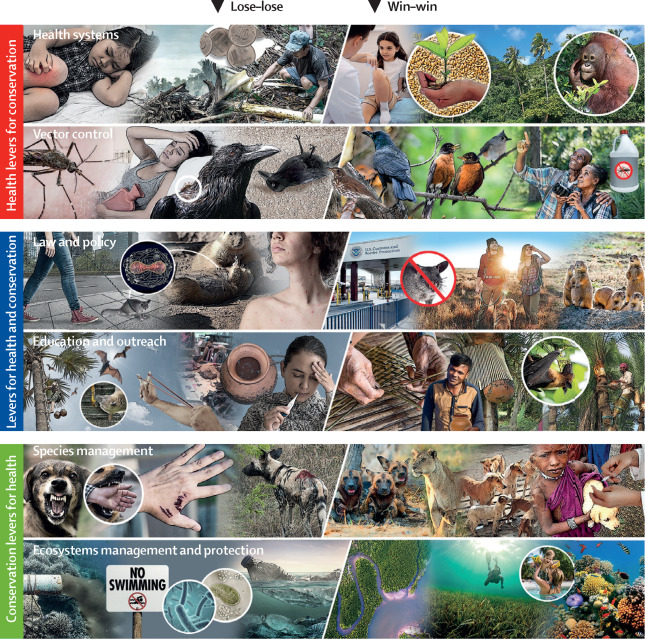

## Genomic epidemiology of schistosomiasis
Recent advances in sequencing technologies make it increasingly feasible to generate genome-scale data on parasites like schistosomes for use in population-based research and surveillance. In collaboration with the Sichuan Center for Disease Control and Prevention and scientists at the University of Colorado and the University of Texas who have developed an efficient method for sequencing genomes from schistosome miracidia collected in the field, we are using relatedness between parasites to understand why and how S. japonicum persists in residual hot spots of infection in southwest China. 

### Relevant publication
- **Lund AJ**, Wade KJ, Nikolakis ZL, Ivey K, Perry BW, Pike H, Paull SH, Liu Y, Castoe TA, Pollock DD, Carlton EJ. Integrating genomic and epidemiologic data to accelerate progress towards schistosomiasis elimination. *eLife* 11:e79320 [Open access](https://doi.org/10.7554/eLife.79320)

## Agricultural livelihoods and schistosome exposure

For my dissertation research, I worked closely with collaborators at the Centre de Recherche Biomedical – Espoir Pour La Sante, University of California – Santa Barbara and Stanford University to understand how rural and agricultural livelihoods contribute to exposure to schistosome parasites through a variety of water contact activities. I have used household surveys to quantify the relationship between agricultural livelihoods and schistosome infection and combined household survey data with ecological and interview data to understand the relative contributions of social and environmental factors to schistosome risk. I have also used qualitative data derived from focus groups to understand local perspectives of disease and the environment and the experience of living in the dammed and endemic landscape along the Senegal River. Future work in this area will focus on how seasonality influences water contact behavior, how livestock ownership influences human infection risk and assessing the spatial relationships between water sources and human activity space. 

### Relevant publications
- **Lund AJ**, Rehkopf DH, Sokolow SH, Sam MM, Jouanard N, Schacht AM, Senghor S, Fall A, Riveau G, De Leo GA, Lopez-Carr D 2021. Land use impacts on parasitic infection: a cross-sectional epidemiological study on the role of irrigated agriculture in schistosome infection in a dammed landscape in West Africa. *Infectious Diseases of Poverty* 10:35. [Open access](https://doi.org/10.1186/s40249-021-00816-5)
- **Lund AJ**, Sam MM, Sy AB, Sow OW, Ali S, Sokolow SH, Bereknyei Merrell S, Bruce J, Jouanard N, Senghor S, Riveau G, Lopez-Carr D, De Leo GA. 2019. Unavoidable risks: Local perspectives on water contact behavior and implications for schistosomiasis control in an agricultural region of northern Senegal. *American Journal of Tropical Medicine and Hygiene* 101(4): 837-847. [Open access](https://doi.org/10.4269/ajtmh.19-0099)
- **Lund AJ**, Sokolow SH, Jones IJ, Wood CL, Ali S, Chamberlin A, Sy AB, Sam MM, Jouanard N, Schacht AM, Senghor S, Fall A, Ndione R, Riveau G, De Leo GA, Lopez-Carr D. Exposure, hazard and vulnerability all contribute to Schistosoma haematobium re-infection in northern Senegal. *PLOS Neglected Tropical Diseases* 15(10): e0009806. [Open access](https://doi.org/10.1371/journal.pntd.0009806)
- Haggerty C, Delius B, Jouanard N, Nado P, De Leo G, **Lund A**, Lopez-Carr D, Remais J, Riveau G, Sokolow S, Rohr J. Identifying low risk insecticides to address both food shortages and the biocontrol of human schistosomiasis. [Pre-print](https://www.biorxiv.org/content/10.1101/2021.01.05.425425v2)

## Mitigating disease around dams
My dissertation research on human livelihoods and schistosomiasis was embedded within a larger project that aimed to implement and evaluate an ecological intervention to control schistosomiasis. Our field sites in the lower basin of the Senegal River suffer a high burden of schistosomiasis in part because of a dam constructed in the 1980s. Dams create an ideal habitat for the snails that transmit schistosomiasis: stabilizing water levels, preventing saltwater intrusion and importantly, disrupting the populations of snail predators. Some of these predators – freshwater prawns – migrate downriver to estuaries to reproduce. When dams block this migration, prawns disappear from upstream reaches of the river and leave snail populations to grow unchecked.

Our research shows that almost half of the 800 million people at risk for schistosomiasis globally are at increased risk because dams block the migration of snail predators. Along the Senegal River, my qualitative research showed that people view the dam as beneficial. It improves both food and economic security, but people also recognized that these benefits  come at a cost. Most people recognize that the tell-tale signs of schistosomiasis have become common among themselves and their children. Modeling analyses indicate that prawn aquaculture can sustainably improve food production, reduce schistosome transmission and increase revenues for small-scale subsistence agriculture.

Since 2017, I have also co-led work that explores the potential for other ways to mitigate disease around dams. With an interdisciplinary team of graduate students supported by the [National Socio-Environmental Synthesis Center (SESYNC)](https://www.sesync.org/), our team  examined how environmental planning in the Senegal River Basin overlooked the health impacts of dam development. We analyzed documents from the river basin authority’s archive to understand how health impacts were framed and prioritized with respect to the traditional objectives of dam development: food, energy, and water resources. By comparing this framing and prioritization across policy, impact assessment and operational documents, we examined whether and how management policies are put into practice. We found that health impacts of dam development were important effects to be mitigated, but proposals to manage dams for disease control have so far not been adopted in practice.

Future work in this area will include empirical analysis of the impact of prawn aquaculture on snail populations and human infection with schistosomes, collaborative work to demonstrate the feasibility of dam management for disease control and eventually field studies to understand the impact of dam management schemes on snail and mosquito ecology as well as human infection risk. 

### Relevant publications
- **Lund AJ**, Harrington ES, Albrecht TR, Hora T, Wall RE, Andarge T. 2022.Tracing the inclusion of health as a component of the food-energy-water nexus in dam management in the Senegal River Basin. *Environmental Science & Policy* 133:74-86 [Open access](https://doi.org/10.1016/j.envsci.2022.03.005)
- **Lund AJ**, Lopez-Carr D, Sokolow SH, Rohr JR, De Leo GA. 2021 Agricultural innovations to reduce the health impacts of dams. *Sustainability* 13:1869 [Open access](https://doi.org/10.3390/su13041869)
- Sokolow SH, Jones IJ, Jocque M, La D, Cords O, Knight A, **Lund A**, Wood CL, Lafferty KD, Kuris AM, Hoover CM, Collender PA, Remais J, Lopez-Carr D, Fisk J, De Leo GA. 2017. Nearly 400 million people are at higher risk of schistosomiasis because dams block the migration of snail-eating river prawns. *Philosophical Transactions of the Royal Society B*. 372(1722): 20160127. [Open access](https://doi.org/10.1098/rstb.2016.0127)
- Hoover CM, Sokolow SH, Kemp J, Sanchirico JN, **Lund AJ**, Jones I, Higginson T, Riveau G, Savaya-Alkalay A, Coyle S, Wood CL, Micheli F, Casagrandi R, Mari L, Gatto M, Rinaldo A, Perez-Saez J, Rohr JR, Sagi A, Remais JV, De Leo GA. 2019. Modelled effects of prawn aquaculture on poverty alleviation and schistosomiasis control. *Nature Sustainability* 2(7): 611-620. [PDF here](Hoover-2019-prawnModel.pdf) 

## Spatial ecology of schistosome transmission
In collaboration with colleagues at Stanford University, University of Washington and Centre de Recherche Biomedical – Espoir Pour La Sante, I contributed to research on the spatial ecology of schistosome transmission along the lower basin of the Senegal River. This work  involved the use of light unmanned aerial vehicles (UAVs, or drones) to identify and sample aquatic microhabitats for the snails that transmit schistosome parasites. We found that snail populations vary so much in space and time that snapshots captured through snail sampling (which involved hundreds of person-hours per site!) did not generate a complete picture of the risk that local people face when using these water sources. In fact, environmental proxies within a water access site (such as the area covered by suitable snail habitat) were better at predicting human infection with *S. haematobium* than snail population data. We concluded that using drones and satellite imagery to quickly estimate the geometry and snail habitat coverage of water contact sites is a useful tool for surveillance and control of schistosomiasis.

Building on our conclusion that the area of snail habitat within a water access site was a good proxy of human infection, I led work that integrated ecological data with household survey and interview data to understand the relative contributions of social and environmental factors to risk of infection with *S. haematobium*. We found that the area of snail habitat (or, hazard) was the most important component of becoming infected, compared to water contact behavior (exposure) and access to water and sanitation infrastructure (vulnerability). When considering the intensity of *S. haematobium* infection, water contact behavior was most important. We also found that accounting for the spatial relationship between households and water access sites often improved the fit of our statistical models compared to previously published village-level aggregations of ecological data.

Future work in this area will involve further integration of social, ecological, and spatial data to understand how human interactions with the environment intersect with the parasites circulating through snail populations in water sources. 

### Relevant publications
- Jones IJ, Sokolow SH, Chamberlin AJ, **Lund AJ**, Jouanard N, Bandagny L, Ndione R, Senghor S, Schacht AM, Riveau G, Hopkins SR, Rohr JR, Remais JV, Lafferty KD, Kuris AM, Wood CL, De Leo GA. Schistosome infection in Senegal is associated with different spatial extents of risk and ecological drivers for Schistosoma haematobium and S. mansoni. *PLOS Neglected Tropical Diseases* 15(9): e0009712 [Open access](https://doi.org/10.1371/journal.pntd.0009712)
- Wood CL, Sokolow SH, Jones IJ, Chamberlin AJ, Lafferty KD, Kuris AM, Jocque M, Hopkins SR, Adams G, Schneider M, Buck JC, **Lund AJ**, Garcia-Vedrenne AE, Fiorenza E, Rohr JR, Allan F, Webster BL, Rabone M, Webster JP, Bandagny L, Ndione R, Senghor S, Schacht AM, Jouanard N, Riveau G, De Leo GA. 2019. Precision mapping of snail habitats provides a powerful indicator of human schistosomiasis transmission. *Proceedings of the National Academy of Sciences* 116(46): 23182-23191. [Open access](https://doi.org/10.1073/pnas.1903698116)
- Chamberlin AJ, Jones IJ, **Lund AJ**, Jouanard N, Riveau G, Ndione R, Sokolow SH, Wood CL, Lafferty KD, De Leo GA 2020. Visualization of schistosomiasis snail habitat using light unmanned aerial vehicles. *Geospatial Health* 15(2):818. [Open access](https://doi.org/10.4081/gh.2020.818)
- **Lund AJ**, Sokolow SH, Jones IJ, Wood CL, Ali S, Chamberlin A, Sy AB, Sam MM, Jouanard N, Schacht AM, Senghor S, Fall A, Ndione R, Riveau G, De Leo GA, Lopez-Carr D. Exposure, hazard and vulnerability all contribute to Schistosoma haematobium re-infection in northern Senegal. *PLOS Neglected Tropical Diseases* 15(10): e0009806. [Open access](https://doi.org/10.1371/journal.pntd.0009806)

## Ecological levers for health
Our working group at the [National Center for Ecological Analysis and Synthesis (NCEAS)](https://www.nceas.ucsb.edu/workinggroups/snapp-ecological-levers-health-advancing-priority-agenda-disease-ecology-and) focused on identifying links between infectious disease transmission and environmental change with the goal of synthesizing knowledge on win-win solutions that can benefit people and nature. We developed a framework for distinguishing win-win solutions from other possible outcomes and developed case studies detailing dozens of proposed solutions that we uncovered through a systematic review of the literature. Check out the website that catalogues all of the win-win solutions we've found and reviewed [here](https://jvr782.wixsite.com/leversforhealth)!

As part of this group, I also contributed to an evaluation of the impact of establishing a health clinic near a national park in Indonesian Borneo as a means of keeping people healthy and reducing incentives to engage in illegal logging to pay for catastrophic health expenses. The clinic, which was co-created by the NGOs Alam Sehat Lestari and [Health in Harmony](https://healthinharmony.org/) and the local communities around Gunung Palung National Park, served thousands of people and reduced deforestation by 70% compared to control sites. 

### Relevant publications
- Hopkins SR, Lafferty KD, Wood CL, Olson SH, Buck JC, Childs M, De Leo GA, Fiorella KJ, Fornberg J, Garchitorena A, Howard ME, Jones IJ, Kuris AM, Kwong LH, LeBoa C, Leon AE, **Lund AJ**, MacDonald AJ, Metz DCG, Nova N, Peel AJ, Remais JV, Stewart Merrill TE, Wilson M, Bonds MH, Dobson AP, Lopez-Carr D, Mandle L, Sokolow SH. Diversity and evidence gaps among potential win-win solutions for conservation and human infectious disease control. *Lancet Planetary Health* 6(8): E694-E805 [Open access](https://doi.org/10.1016/S2542-5196(22)00148-6)   
- Hopkins S, Sokolow S, De Leo G, Buck J, Jones I, Kwong L, LeBoa C, **Lund AJ**, MacDonald A, Nova N, Olson S, Peel A, Wood C, Lafferty K. 2020. Identifying win-wins for people and nature. *Nature Sustainability* 4: 298-304. [PDF here](Hopkins-2020-NatSust.pdf)  
- Hopkins SR, Jones IJ, Buck JC, LeBoa C, Kwong LH, Jacobsen K, Rickards C, **Lund AJ**, Nova N, MacDonald AJ, Lambert-Peck M, De Leo GA, Sokolow SH 2022. Environmental persistence of the world’s most burdensome infectious and parasitic diseases. *Frontiers in Public Health* 10:892366 [Open access](https://doi.org/10.3389/fpubh.2022.892366)  
- Jones IJ, MacDonald AJ, Hopkins S, **Lund AJ**, Liu ZY, Fawsi NI, Purba MP, Fankhauser K, Chamberlin AJ, Nirmala M, Blundell AG, Emerson A, Jennings J, Gaffikin L, Barry M, Lopez-Carr D, Webb K, De Leo GA, Sokolow SH. 2020. Improving rural health care reduces illegal logging and conserves carbon in a tropical forest. *Proceedings of the National Academy of Sciences* 117(45): 28515-28524 [Open access](https://doi.org/10.1073/pnas.2009240117)  
- Sokolow SH, Jones IJ, Wood CL, Lafferty KD, Garchitorena A, Hopkins SR, **Lund AJ**, MacDonald AJ, Nova N, LeBoa C, Peel AJ, Mordecai EA, Chamberlin A, Howard M, Buck JC, Lopez-Carr D, Barry M, Bonds M, De Leo GA. More than one third of global human infectious disease burden is environmentally mediated, with disproportionate effects in rural poor areas.  [Pre-print](http://dx.doi.org/10.2139/ssrn.3457412)  
- Garchitorena A, Sokolow SH, Roche B, Ngonghala CN, Jocque M, **Lund A**, Barry M, Mordecai EA, Daily GC, Jones JH, Andrews JR, Bendavid E, Luby SP, LaBeaud AD, Seetah K, Guegan JR, Bonds MH, De Leo GA. 2017. Disease ecology health and the environment: a framework to account for ecological and socio-economic drivers in the control of neglected tropical disease. *Philosophical Transactions of the Royal Society B*. 372(1722) [Open access](https://doi.org/10.1098/rstb.2016.0128)
